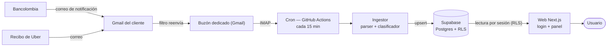
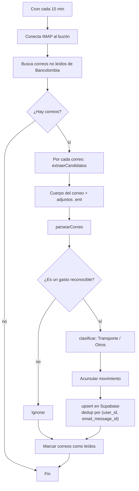
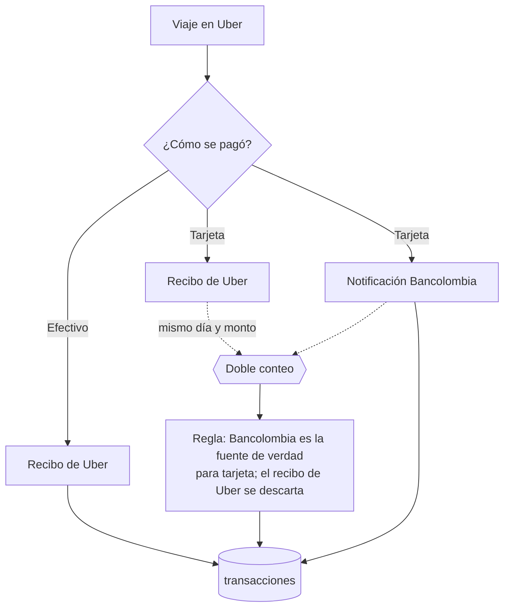
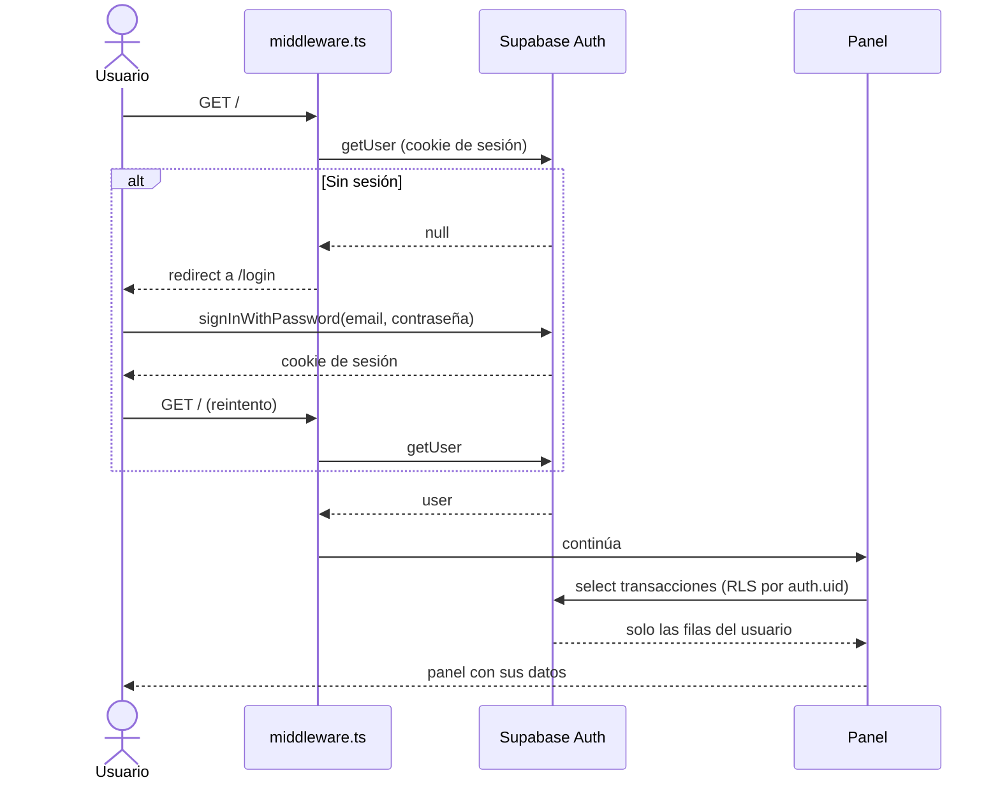
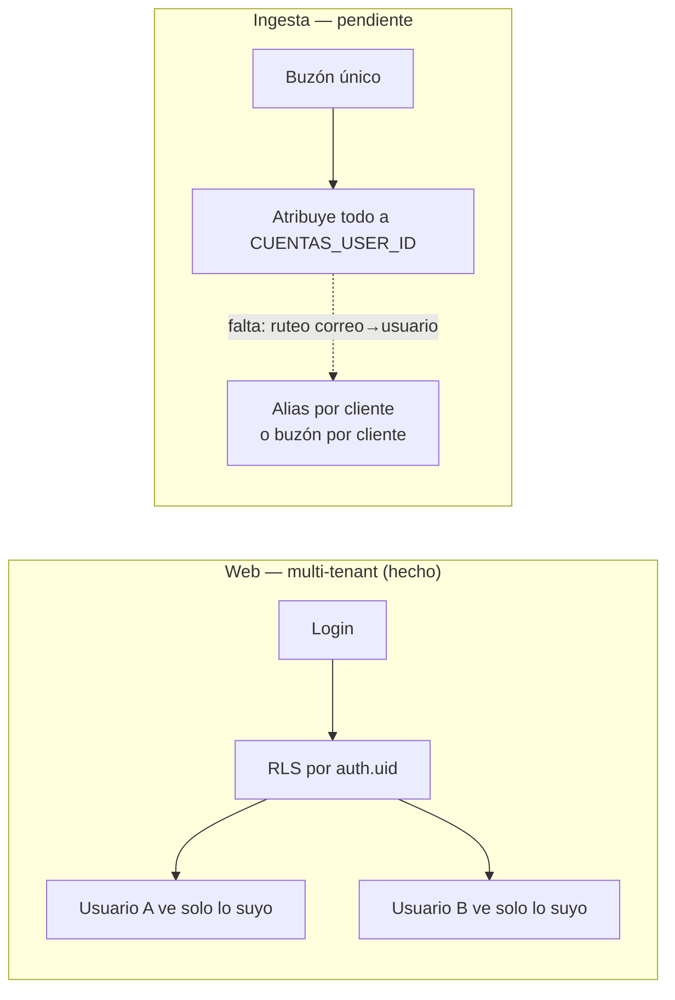
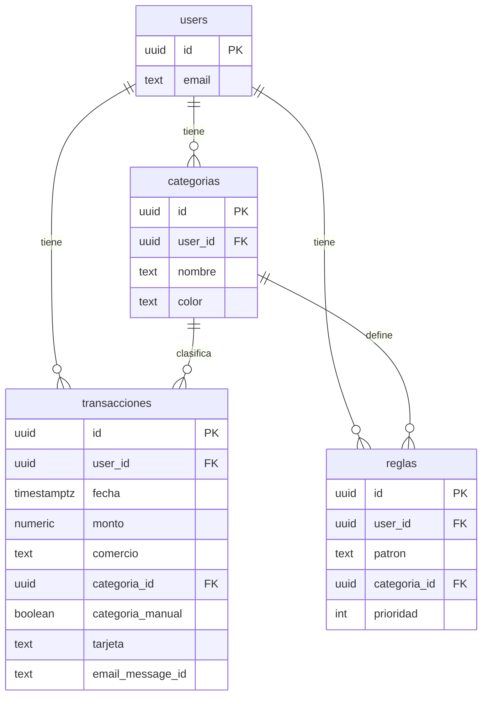
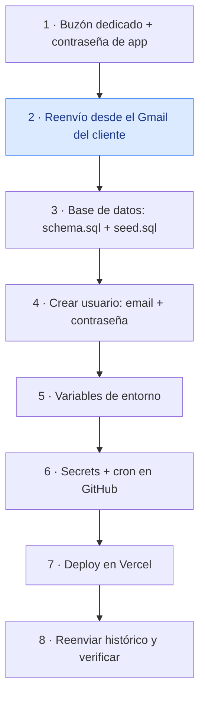
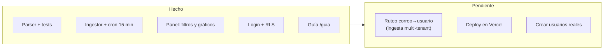

# Arquitectura de CUENTAS

Documentación técnica del sistema: cómo un correo de Bancolombia termina como un
gráfico en el panel, y cómo encajan la ingesta, la base de datos y la web.

> Los diagramas están en [Mermaid](https://mermaid.js.org/); GitHub los renderiza
> automáticamente. Complementa a los specs en `docs/superpowers/specs/`.

## Índice

1. [Visión general](#1-visión-general)
2. [Flujo de ingesta](#2-flujo-de-ingesta)
3. [Recibos de Uber y doble conteo](#3-recibos-de-uber-y-doble-conteo)
4. [Autenticación y multi-tenant](#4-autenticación-y-multi-tenant)
5. [Modelo de datos](#5-modelo-de-datos)
6. [Onboarding de un cliente nuevo](#6-onboarding-de-un-cliente-nuevo)
7. [Estado y próximos pasos](#7-estado-y-próximos-pasos)

---

## 1. Visión general

El sistema es una tubería: los correos de notificación de Bancolombia (y los
recibos de Uber) se reenvían a un buzón dedicado, un cron los lee y parsea, los
guarda en Supabase, y la web los muestra por usuario.

| Pieza | Archivo | Rol |
|---|---|---|
| Parser | `src/lib/parser.ts`, `src/lib/parser-uber.ts` | Extrae monto, comercio, fecha, tarjeta del correo |
| Clasificador | `src/lib/classifier.ts` | Reglas comercio → Transporte / Otros |
| Ingestor | `src/ingest/ingest.ts` | Lee IMAP y guarda en Supabase |
| Cron | `.github/workflows/ingest.yml` | Ejecuta el ingestor cada 15 min |
| Web | `app/`, `src/components/` | Login + panel con filtros y gráficos |
| Base de datos | `db/schema.sql` | Tablas + seguridad por fila (RLS) |

---

## 2. Flujo de ingesta

El ingestor corre sin interfaz (backend). Lee los correos no leídos del buzón,
saca los movimientos y hace `upsert` idempotente: correr el cron varias veces no
duplica datos, porque la clave `(user_id, email_message_id)` es única.

**Puntos clave**

- `extraerCandidatos` cubre el reenvío normal (el cuerpo del correo) y el
  "reenviar como adjunto" (varios `.eml` dentro de un correo, para migrar el
  histórico).
- El `upsert` usa `ignoreDuplicates: true`: si una transacción ya existe, **no**
  se sobreescribe → las ediciones manuales de categoría (`categoria_manual`) se
  conservan entre corridas.

---

## 3. Recibos de Uber y doble conteo

Un mismo viaje de Uber puede llegar por **dos fuentes**: el recibo de Uber
(cubre efectivo *y* tarjeta) y la notificación de Bancolombia (solo tarjeta).
Sin cuidado, los viajes con tarjeta se contarían dos veces.

- **Efectivo:** solo existe en el recibo de Uber → se conserva.
- **Tarjeta:** existe en ambas fuentes → se conserva la notificación de
  Bancolombia (fuente continua vía el ingestor) y se descarta el recibo de Uber.
- Detalle completo y decisión en la memoria del proyecto (`uber-doble-fuente`).

---

## 4. Autenticación y multi-tenant

La web es **multi-cliente**: cada usuario inicia sesión y ve solo sus datos. Esto
lo garantiza la *seguridad por fila* (RLS) de Postgres: las consultas se filtran
por `auth.uid()`, no por un id fijo en el código.

**Web vs. ingesta** — hoy la web ya es multi-tenant; la ingesta aún no:

- La web usa la **anon key + sesión** (`src/lib/supabase-server.ts`), no la
  service role.
- El ingestor sigue usando la **service role** + `CUENTAS_USER_ID` (backend). El
  ruteo correo→usuario es el siguiente paso para multi-tenant real de datos.

---

## 5. Modelo de datos

Todo cuelga de `auth.users`. Cada tabla lleva `user_id` y una política RLS que
restringe filas al dueño (`auth.uid() = user_id`).

- `unique (user_id, email_message_id)` en `transacciones` evita duplicados y
  hace idempotente al ingestor.
- `categoria_manual = true` marca una categoría editada por el usuario para que
  el reclasificador no la pise.

---

## 6. Onboarding de un cliente nuevo

Los pasos para dar de alta un cliente (misma info que la guía en `/guia`). El
paso marcado lo hace el **cliente**; el resto, el **operador**.

La guía in-app (`/guia`) muestra estos pasos con valores copiables (host IMAP,
remitente a filtrar, nombres de variables, comandos de migración).

---

## 7. Estado y próximos pasos

| Estado | Ítem |
|---|---|
| ✅ | Parser (Bancolombia + Uber) probado |
| ✅ | Ingestor IMAP + cron cada 15 min |
| ✅ | Panel con filtros, agrupaciones y gráficos (responsive) |
| ✅ | Login con Supabase Auth + RLS (web multi-tenant) |
| ✅ | Guía de onboarding en `/guia` |
| ⏳ | Ruteo correo→usuario en el ingestor (datos multi-tenant automáticos) |
| ⏳ | Deploy en Vercel + creación de usuarios reales |
